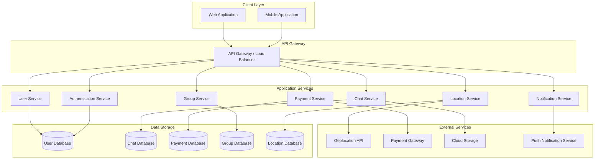
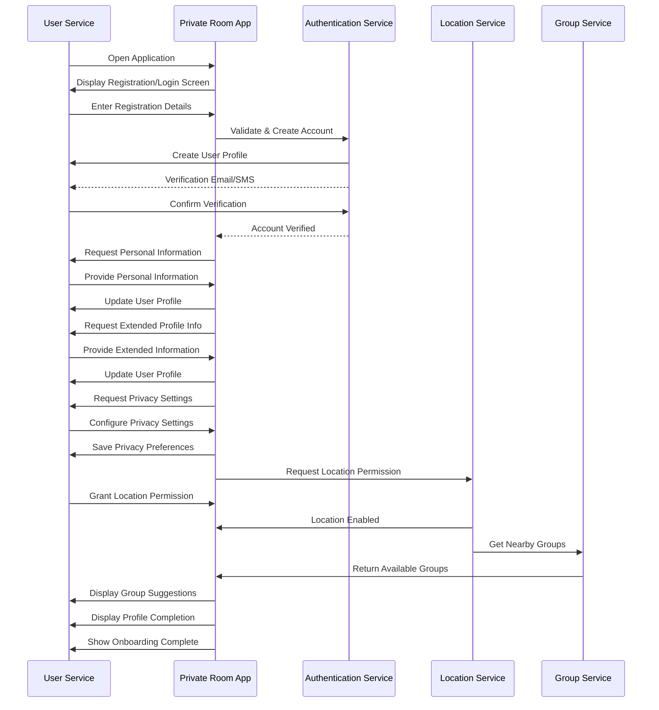
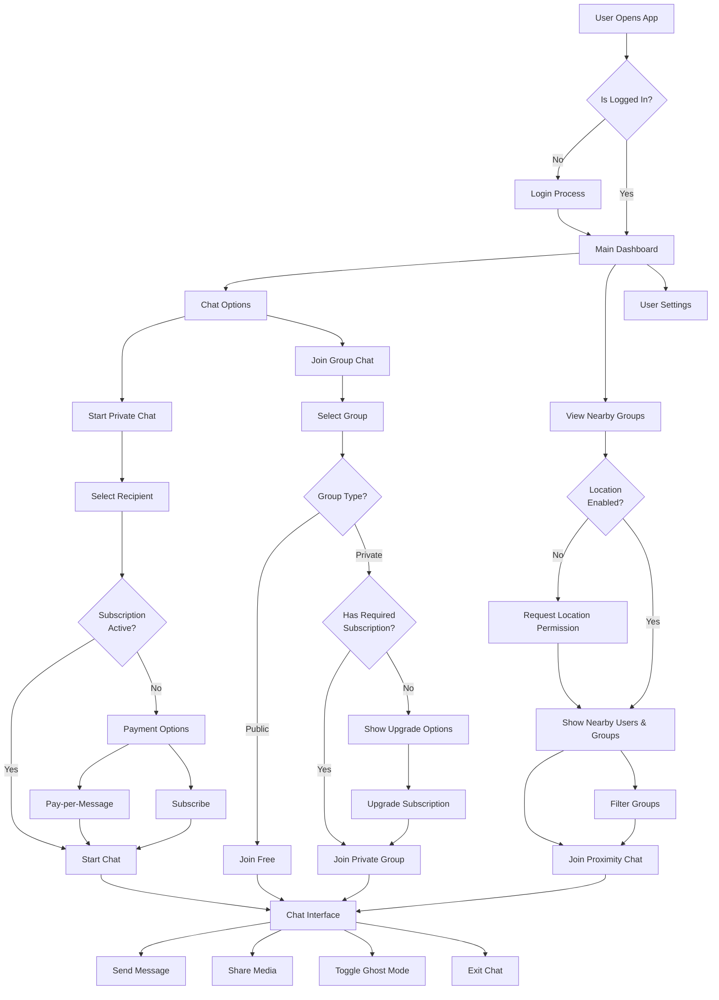
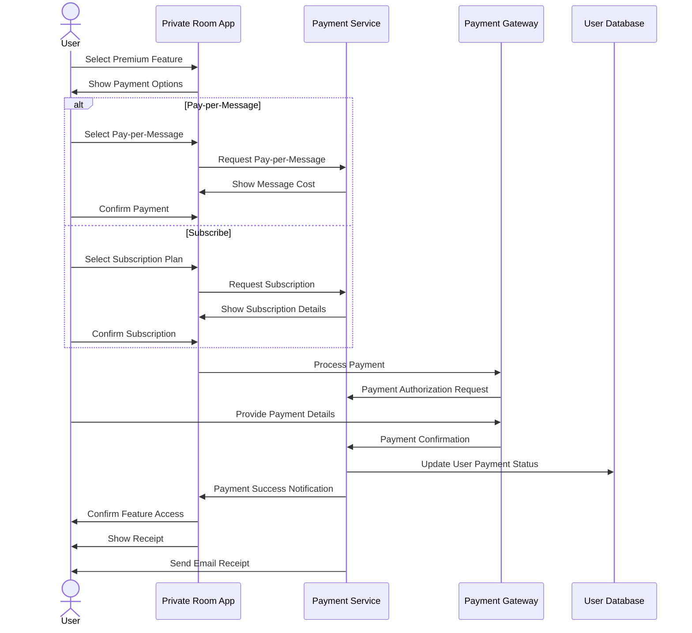
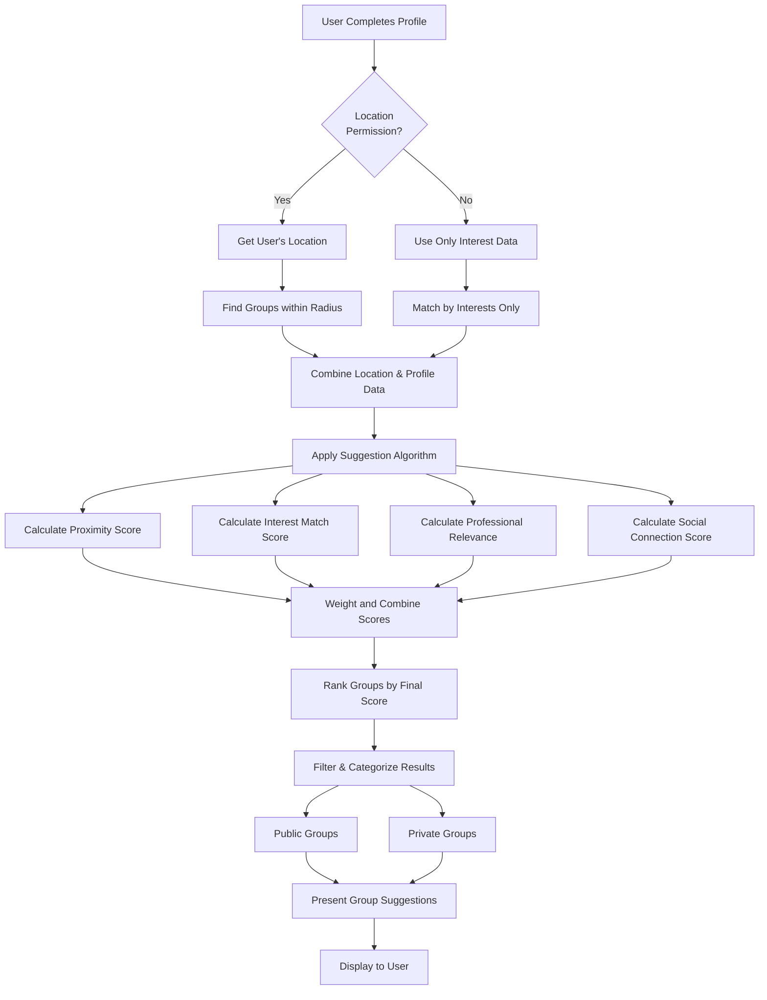

# Private Room - Business Requirements & System Design Documentation

**Version 1.0**  
**Date: 07.04.2025**  
**Document Owner: Serv&**

## Executive Summary

Private Room is an innovative digital communication platform designed to connect individuals, companies, and educational institutions in a secure and flexible environment. This document outlines the comprehensive business requirements and system design for the platform, which features unique monetization models, proximity-based chat functionality, and robust privacy controls.

The platform's key differentiators include geolocation-based communication, automatic group creation based on user context, and a hybrid monetization approach combining subscriptions and pay-per-use models. The document details functional and non-functional requirements, system architecture, user flows, and essential implementation considerations.

This solution has been designed to address market gaps in specialized communication platforms while maintaining security, scalability, and user privacy as core priorities.

---

## Table of Contents

1. [Introduction](#introduction)
   - [Purpose](#purpose)
   - [Background](#background)
   - [Intended Audience](#intended-audience)

2. [Business Objectives](#business-objectives)

3. [Project Scope](#project-scope)
   - [In-Scope](#in-scope)
   - [Out-of-Scope](#out-of-scope)

4. [Functional Requirements](#functional-requirements)
   - [Private Chats](#requirement-id-fr-001)
   - [Proximity Chats](#requirement-id-fr-002)
   - [Automatic Group Creation](#requirement-id-fr-003)
   - [Ghost Mode](#requirement-id-fr-004)
   - [Sleeping Mode](#requirement-id-fr-005)
   - [Monetization Functions](#requirement-id-fr-006)
   - [User Registration and Profile Setup](#requirement-id-fr-007)
   - [Intelligent Group Suggestions](#requirement-id-fr-008)

5. [Non-Functional Requirements](#non-functional-requirements)
   - [System Performance](#requirement-id-nfr-001)
   - [Security](#requirement-id-nfr-002)
   - [Scalability](#requirement-id-nfr-003)
   - [Usability](#requirement-id-nfr-004)
   - [Reliability](#requirement-id-nfr-005)
   - [Compliance](#requirement-id-nfr-006)

6. [System Architecture and Design](#system-architecture-and-design)
   - [System Architecture Overview](#system-architecture-overview)
   - [User Registration and Onboarding Flow](#user-registration-and-onboarding-flow)
   - [Chat and Group Functionality Flow](#chat-and-group-functionality-flow)
   - [Payment Processing Flow](#payment-processing-flow)
   - [Group Suggestion Algorithm Flow](#group-suggestion-algorithm-flow)

7. [Assumptions and Dependencies](#assumptions-and-dependencies)
   - [Assumptions](#assumptions)
   - [Dependencies](#dependencies)

8. [Constraints](#constraints)

9. [Risks](#risks)

10. [Acceptance Criteria](#acceptance-criteria)

11. [Timeline & Milestones](#timeline--milestones)

12. [Stakeholders](#stakeholders)

13. [Appendices](#appendices)

14. [Sign-Off](#sign-off)

---

## Document Revision History

| Version | Date       | Description of Change | Author |
|---------|------------|-----------------------|--------|
| 1.0     | 07/04/2025 | Initial draft         | Serv&  |

## 1. Introduction

### Purpose

The purpose of this document is to outline the business requirements for the "Private Room" platform, an innovative digital communication space designed to connect individuals, companies, and educational institutions securely and flexibly.

### Background

Private Room aims to provide a secure and flexible digital space for private communication, proximity chats, and target group-specific functions supported by a unique monetization model.

### Intended Audience

This document is intended for software developers, project managers, and stakeholders involved in the development and deployment of the Private Room platform.

## Business Objectives

- To provide a secure platform for private communication.
- To enable proximity-based chats and dynamic group creation.
- To implement a unique monetization model through subscriptions and pay-per-message.

## Project Scope

### In-Scope

- Development of private and proximity chat features.
- Implementation of automatic group creation.
- Integration of monetization functions.
- Deployment on cloud infrastructure for scalability.

### Out-of-Scope

- Development of non-core features not listed in the main functions.
- Support for platforms not specified in the technical architecture.

## Functional Requirements

### Requirement ID: FR-001
- **Title**: Private Chats
- **Description**: The system shall enable users to initiate and maintain private communications with specific individuals or groups through a pay-per-message or subscription model.

  *Chat Features:*
  1. One-to-one private messaging
  2. Private group chats (up to 100 members)
  3. Media sharing (images, videos, documents)
  4. Read receipts and typing indicators
  5. Message history with search functionality

  *Monetization Options:*
  - **Pay-per-message**: Users pay a small fee (e.g., $0.05-0.10) per message sent
  - **Subscription**: Users pay a recurring fee (e.g., $4.99/month) for unlimited messaging
  - **Bundle packages**: Discounted message packs (e.g., 100 messages for $3.99)
  
- **User Story**: As a user, I want to initiate private chats so that I can communicate securely and privately with selected individuals or groups.

- **Priority**: High

- **Acceptance Criteria**: 
  1. Users can create private chats with any other user or create private groups
  2. The system clearly displays monetization options before initiating a private chat
  3. Users receive confirmation before charges are applied
  4. Subscription status and message credits are prominently displayed
  5. Chat history is securely stored and accessible to participating users
  6. Users can block or report others in private chats

*Example Private Chat Interface:*
```
[New Private Chat]
Recipient: Jane Smith
Monetization Option: [Pay-per-message] [Subscribe $4.99/month]

Notice: Private chats require either pay-per-message ($0.10/msg) 
or a monthly subscription ($4.99). Your selection: Subscription
Current status: 26 days remaining in subscription

[Chat begins with welcome message and privacy reminder]
```

### Requirement ID: FR-002
- **Title**: Proximity Chats
- **Description**: The system shall use geolocation to identify and display nearby users, automatically creating location-based chat groups for spontaneous communication.

  *Proximity Features:*
  1. Real-time user discovery within configurable radius (25-50 meters default)
  2. Automatic group formation based on location context
  3. Dynamic membership updates as users enter/leave the area
  4. Location-specific chat groups (e.g., neighborhoods, events, venues)
  5. Map view of nearby active groups
  
  *Group Types:*
  - **Temporary**: Dissolve when members leave the area (e.g., event chats)
  - **Persistent**: Remain active for specific locations (e.g., campus, workplace)
  - **Custom**: User-defined proximity groups with invitations
  
- **User Story**: As a user, I want to see and chat with nearby users to connect with my local community and participate in location-based discussions.

- **Priority**: High

- **Acceptance Criteria**: 
  1. The system detects and displays nearby users within 10 seconds of location update
  2. Users can join any proximity-based group chat within their geographical radius
  3. Group membership updates in real-time as users enter or leave the area
  4. Proximity chat includes location context (e.g., building name, event)
  5. Users can temporarily hide their presence from proximity detection
  6. System prompts for location permissions with clear privacy explanations

*Example Proximity Interface:*
```
[NEARBY]
- Coffee Shop Group (12 active users, 25m away)
- Downtown Business District (47 users, 120m away)
- Central Park Event (83 users, 300m away)

[MAP VIEW]
- Interactive map showing group concentrations and boundaries
- User location indicator with radius circle
- Quick-join buttons for visible groups
```

### Requirement ID: FR-003
- **Title**: Automatic Group Creation
- **Description**: The system shall automatically create and manage chat groups based on user contexts such as workplace, educational courses, events, or other shared attributes.

  *Context Detection Methods:*
  1. Location consistency (e.g., repeated presence at workplace)
  2. Calendar integration (for events and schedules)
  3. Educational institution data (courses, departments)
  4. Professional information (company, department, role)
  5. Manual verification for sensitive contexts
  
  *Group Structure:*
  - **Roles**: Admin, Moderator, Member
  - **Permissions**: Invitation control, content moderation, membership management
  - **Lifecycle**: Creation, growth, maintenance, archival
  
- **User Story**: As a user, I want to be automatically added to relevant groups based on my context, so I can easily communicate with peers without manual setup.

- **Priority**: Medium

- **Acceptance Criteria**: 
  1. The system suggests context-relevant groups within 24 hours of detecting consistent patterns
  2. Users receive clear notifications about automatic group additions with opt-out options
  3. Group membership accurately reflects real-world contexts with minimal false positives
  4. Group structures include appropriate role assignments based on context
  5. Users can request verification of their role within a context-based group
  6. Automatic groups maintain privacy boundaries appropriate to their context

*Example Auto-Group Creation:*
```
[NEW GROUP DETECTED]
The system has identified that you regularly visit "TechCorp Office" 
and may be an employee there.

Would you like to:
[Join the TechCorp Employee Group] [Decline] [Not Now]

Group Details:
- 86 members from TechCorp
- Active since March 2025
- Department sub-groups available
```

### Requirement ID: FR-004
- **Title**: Ghost Mode
- **Description**: The system shall provide an anonymous interaction feature that allows users to participate in chats without revealing their identity or location information.

  *Ghost Mode Features:*
  1. Temporary anonymous identity generation
  2. Location masking for proximity features
  3. Privacy filters for personally identifiable information
  4. Configurable anonymity levels (full, partial)
  5. Time-limited ghost sessions with automatic expiration
  
  *Privacy Protections:*
  - **Identity shielding**: Replacement of name/photo with anonymous placeholder
  - **Location obfuscation**: Randomization within a safe radius
  - **Voice modulation**: For voice messages/calls (if applicable)
  
- **User Story**: As a user, I want to participate in chats anonymously to protect my privacy while still engaging with relevant conversations.

- **Priority**: Medium

- **Acceptance Criteria**: 
  1. Users can enable ghost mode with a single interaction
  2. Ghost mode clearly indicates active status to the user at all times
  3. Other users cannot determine the real identity of someone in ghost mode
  4. The system prevents accidental identity revelation while ghost mode is active
  5. Users can customize their level of anonymity through simple settings
  6. Ghost mode automatically expires after a configurable time period

*Example Ghost Mode Interface:*
```
[GHOST MODE: ACTIVE]
Your temporary identity: Anonymous User #42891
Location: Hidden (actual: 500m randomized radius)
Duration: 2 hours remaining

You are currently visible in:
- Downtown Chat (as Anonymous)
- Photography Group (as Anonymous)

[Customize Anonymity] [End Ghost Mode]
```

### Requirement ID: FR-005
- **Title**: Sleeping Mode
- **Description**: The system shall provide a feature allowing users to temporarily deactivate notifications and activity tracking without leaving their groups or losing membership status.

  *Sleeping Mode Options:*
  1. Timed deactivation (1 hour, 8 hours, 24 hours, custom)
  2. Selective sleeping by group or conversation
  3. Auto-response message for incoming communications
  4. Priority breakthrough settings for urgent messages
  5. Scheduled sleeping periods (e.g., work hours, nighttime)
  
  *Status Indicators:*
  - **For user**: Countdown timer for sleep duration
  - **For others**: "Away" or "Unavailable" status with optional return time
  
- **User Story**: As a user, I want to pause notifications and activities temporarily without leaving my groups so that I can focus or disconnect temporarily.

- **Priority**: Low

- **Acceptance Criteria**: 
  1. Users can activate sleeping mode with customizable duration
  2. Notifications are suppressed while sleeping mode is active
  3. Group membership and access remain intact during sleep periods
  4. The system provides a visual countdown of remaining sleep time
  5. Users can configure priority senders who can break through sleeping mode
  6. The system automatically restores normal functionality when sleep period ends

*Example Sleeping Mode Setup:*
```
[ACTIVATE SLEEPING MODE]
Duration: [1 hour] [8 hours] [24 hours] [Custom: __ hours]

Apply to:
[x] All conversations and groups
[ ] Selected conversations (Tap to select)

Auto-reply message:
"I'm currently unavailable and will see messages when I return."

Priority breakthrough:
[Add priority contacts who can still notify you]

[Activate] [Cancel]
```

### Requirement ID: FR-006
- **Title**: Monetization Functions
- **Description**: The system shall implement various payment models and revenue generation mechanisms to enable premium features and sustainable platform growth.

  *Monetization Models:*
  1. Subscription tiers (Basic, Premium, Business)
  2. Pay-per-use for specific premium features
  3. Credit-based system for private communications
  4. In-app purchases for digital goods and premium status
  5. Advertising spaces for businesses to reconnect with users
  
  *Payment Processing:*
  - **Methods**: Credit/debit cards, digital wallets, mobile payment integration
  - **Security**: PCI compliance, fraud detection, secure transaction processing
  - **Management**: Subscription management, payment history, receipts
  
- **User Story**: As a user, I want to choose between different payment models to access premium features that enhance my communication experience.

- **Priority**: High

- **Acceptance Criteria**: 
  1. Users can select and switch between different monetization models
  2. The system clearly communicates pricing and feature availability for each option
  3. Payment processing is secure and confirms transactions within 5 seconds
  4. Users receive detailed receipts and payment history
  5. Subscription management allows easy changes or cancellations
  6. The system provides grace periods for subscription renewals and payment failures

*Example Monetization Interface:*
```
[PREMIUM FEATURES]
Current Plan: Basic (Free)

Upgrade Options:
1. Premium Individual: $9.99/month
   - Unlimited private chats
   - Ghost mode access
   - No advertisements
   - Priority in proximity chats

2. Business: $19.99/month
   - All Premium features
   - Direct messaging to non-contacts
   - Analytics dashboard
   - Priority support

3. Pay-As-You-Go:
   - Private messages: $0.10 each
   - Ghost mode: $1.99 per hour
   - Custom packages available

[Upgrade Now] [Learn More]
```

### Requirement ID: FR-007
- **Title**: User Registration and Profile Setup
- **Description**: The system shall provide a comprehensive user registration process that collects essential profile information to enhance the user experience and facilitate relevant connections.

  *Registration Flow:*
  1. Basic Account Creation: Email/phone verification
  2. Personal Information Collection: Name, age, profile picture
  3. Extended Profile Setup: Bio, interests, occupation, education
  4. Privacy Settings Configuration: Visibility preferences, data sharing options
  5. Location Services Permission: Geographic positioning for proximity features

  *Required Information:*
  - **Mandatory Fields**: Name, email/phone, age verification, password
  - **Recommended Fields**: Profile picture, bio (limited to 200 characters), 3-5 interest tags
  - **Optional Fields**: Work details, education history, social media links

  *Field Validation:*
  - Email format validation with verification code
  - Password strength requirements (min. 8 characters, alphanumeric with special characters)
  - Age verification to ensure compliance with minimum age requirements
  
- **User Story**: As a new user, I want a simple yet comprehensive registration process that collects my relevant information so that I can quickly set up my profile and begin using the app with a personalized experience.

- **Priority**: High

- **Acceptance Criteria**: 
  1. Users can register using email, phone number, or social media accounts
  2. Multi-step registration process presents a clear progress indicator
  3. Field validations provide immediate feedback on input errors
  4. Users can save partial progress and complete registration later
  5. Privacy policy and terms of service are clearly presented for user consent
  6. Profile completion indicator helps users understand the completeness of their profile
  7. Users receive guidance on optimal profile setup through tooltips and examples

*Example User Registration Flow:*
```
Step 1: Account Creation
- Email: user@example.com
- Password: ********
- Phone: +1 (555) 123-4567 (for verification)
- Verification code sent and validated

Step 2: Personal Information
- Name: John Smith
- Age: 28
- Profile Picture: [Upload interface]

Step 3: Extended Profile
- Bio: "Software engineer passionate about mobile apps and hiking"
- Interests: [Technology] [Outdoors] [Photography]
- Occupation: Software Developer at TechCorp
- Education: Computer Science, University of Technology

Step 4: Privacy Settings
- Profile visibility: [Public] [Friends Only] [Private]
- Location sharing: [Always] [While Using] [Never]
```

### Requirement ID: FR-008
- **Title**: Intelligent Group Suggestions
- **Description**: The system shall intelligently suggest relevant public and private groups to users based on their profile information, interests, and geographic location. Suggestions shall be categorized as public (free to join) or private (subscription-required), with clear visual differentiation.

  *Suggestion Parameters:*
  1. Geographic Proximity: Groups within configurable radius (default 25-50 meters)
  2. Interest Alignment: Matching user interests with group themes and activities
  3. Professional Relevance: Work or education-related groups
  4. Social Connections: Groups containing existing contacts
  5. Activity Patterns: User behavioral data to improve suggestion relevance over time

  *Suggestion Presentation:*
  - Categorized tabs for different types of groups (Nearby, Interest-based, Professional)
  - Clear visual distinction between public and private groups
  - Subscription status indicator for private groups
  - Preview of group details (member count, activity level, top topics)
  - Personalized relevance score or matching percentage
  
- **User Story**: As a user, I want to receive intelligent suggestions for groups that match my interests, location, and social connections so that I can easily discover and join relevant communities.

- **Priority**: High

- **Acceptance Criteria**: 
  1. The system suggests groups based on user's current location within 5 seconds of profile completion
  2. Suggestions are refreshed when user location changes significantly (>100 meters)
  3. Public groups are clearly labeled and immediately joinable
  4. Private groups display subscription requirements and joining process
  5. Users can filter suggestions by various parameters (distance, activity, size)
  6. Suggestion algorithm improves based on user interaction patterns
  7. Users can browse through at least 20 suggested groups upon initial setup

*Example Group Suggestion Interface:*
```
NEARBY GROUPS (within 500m)
1. [PUBLIC] Tech Startup Hub - 28 members
   88% match with your interests - Active now
   Top topics: Mobile Development, Entrepreneurship
   [Join Free]

2. [PRIVATE] Executive Networking - 45 members
   75% match with your professional profile
   Requires Business Subscription ($14.99/month)
   [View Details] [Subscribe]

INTEREST-BASED GROUPS
1. [PUBLIC] Photography Enthusiasts - 136 members
   95% match with your interests - Last active: Today
   [Join Free]

PROFESSIONAL GROUPS
1. [PRIVATE] Software Architects Guild - 89 members
   90% match with your work experience
   Requires Professional Subscription ($9.99/month)
   [View Details] [Subscribe]
```

## Non-Functional Requirements

### Requirement ID: NFR-001
- **Title**: System Performance
- **Description**: The system shall maintain responsive performance under varying load conditions to ensure a smooth user experience.

  *Performance Metrics:*
  1. Concurrency: Support for at least 10,000 concurrent users
  2. Response Time: Under 1 second for 95% of requests
  3. Message Delivery: Real-time message delivery with <500ms latency
  4. Search Speed: Results returned in <2 seconds for any query
  5. Media Loading: Images load within 3 seconds on standard connections

  *Load Handling:*
  - Auto-scaling infrastructure to handle traffic spikes
  - Caching strategies for frequently accessed content
  - Resource optimization for mobile and low-bandwidth connections
  
- **Priority**: High

- **Acceptance Criteria**: 
  1. Performance testing confirms handling of 10,000+ concurrent users
  2. Response time monitoring shows 95% of requests completed in <1 second
  3. System maintains performance during peak usage periods
  4. Automatic alerts trigger when performance thresholds are approached
  5. Performance degradation is graceful under extreme load conditions

### Requirement ID: NFR-002
- **Title**: Security
- **Description**: The system shall implement comprehensive security measures to protect user data, communications, and privacy.

  *Security Features:*
  1. End-to-end encryption (E2EE) for all private communications
  2. Secure authentication with multi-factor options
  3. Regular security audits and penetration testing
  4. Compliance with industry security standards (OWASP, NIST)
  5. Secure data storage with encryption at rest

  *Privacy Protections:*
  - Data minimization principles
  - User control over personal information
  - Transparent privacy policies
  - Regular security notifications to users
  
- **Priority**: High

- **Acceptance Criteria**: 
  1. All communications protected by E2EE with no backdoors
  2. Security testing identifies and resolves vulnerabilities before release
  3. Authentication system prevents common attack vectors (brute force, credential stuffing)
  4. System passes independent security audit
  5. Users are notified of security-related activities on their accounts

### Requirement ID: NFR-003
- **Title**: Scalability
- **Description**: The system architecture shall be designed to scale horizontally and vertically to accommodate growing user base and increased data volume.

  *Scalability Aspects:*
  1. User Base: Ability to scale from thousands to millions of users
  2. Data Volume: Efficient handling of growing message and media storage
  3. Geographic Distribution: Multi-region deployment for global user base
  4. Feature Expansion: Architecture that allows new features without redesign
  5. Load Balancing: Intelligent distribution of system resources

  *Scaling Mechanisms:*
  - Microservices architecture for independent scaling of components
  - Database sharding for data distribution
  - Content delivery networks for media distribution
  - Containerization for deployment flexibility
  
- **Priority**: High

- **Acceptance Criteria**: 
  1. Architecture document demonstrates scalability approach
  2. System maintains performance when user count increases by 200%
  3. Storage solutions scale efficiently with data growth
  4. Response times remain consistent as system scales
  5. Scaling operations occur without service interruption

### Requirement ID: NFR-004
- **Title**: Usability
- **Description**: The system shall provide an intuitive, accessible, and user-friendly interface that aligns with contemporary design standards and user expectations.

  *Usability Features:*
  1. Intuitive Navigation: Clear information hierarchy and navigation paths
  2. Accessibility: Compliance with WCAG 2.1 AA standards
  3. Familiar Patterns: Interface similar to popular messaging applications
  4. Responsive Design: Adaptation to various screen sizes and orientations
  5. Feedback Systems: Clear visual/audio cues for user actions

  *User Experience:*
  - First-time user onboarding guidance
  - Contextual help and tooltips
  - Customization options for individual preferences
  - Consistent design language throughout the application
  
- **Priority**: Medium

- **Acceptance Criteria**: 
  1. Usability testing with target demographics achieves >85% task completion rate
  2. Accessibility audit confirms WCAG 2.1 AA compliance
  3. User satisfaction survey shows >80% positive ratings for interface
  4. New users can complete basic tasks without assistance
  5. Interface performs consistently across supported devices and platforms

### Requirement ID: NFR-005
- **Title**: Reliability
- **Description**: The system shall maintain consistent availability and operational integrity, minimizing downtime and service interruptions.

  *Reliability Measures:*
  1. Uptime: 99.9% service availability (maximum 8.76 hours downtime per year)
  2. Fault Tolerance: Continued operation despite component failures
  3. Data Integrity: Prevention of data corruption or loss
  4. Disaster Recovery: Rapid restoration after major incidents
  5. Maintenance Windows: Scheduled updates with minimal disruption

  *Failover Mechanisms:*
  - Redundant systems for critical components
  - Automated failover processes
  - Regular backup and recovery testing
  - Health monitoring and predictive maintenance
  
- **Priority**: High

- **Acceptance Criteria**: 
  1. System achieves 99.9% uptime during normal operation
  2. Failure of individual components does not cause system-wide outages
  3. Data backup and recovery processes are verified through regular testing
  4. System includes comprehensive monitoring and alerting for potential issues
  5. Maintenance can be performed with minimal user impact

### Requirement ID: NFR-006
- **Title**: Compliance
- **Description**: The system shall comply with relevant legal, regulatory, and industry standards for data protection, privacy, and digital communications.

  *Compliance Areas:*
  1. Data Protection: GDPR, CCPA, and other regional privacy regulations
  2. Digital Communications: Telecommunications regulations and standards
  3. Financial: PCI DSS for payment processing
  4. Accessibility: WCAG and accessibility standards
  5. Industry: Relevant communication platform best practices

  *Compliance Features:*
  - Data subject access request handling
  - Consent management system
  - Age verification mechanisms
  - Data retention and deletion policies
  - Comprehensive audit trails
  
- **Priority**: High

- **Acceptance Criteria**: 
  1. Legal review confirms compliance with applicable regulations
  2. System includes mechanisms for handling user data requests (access, deletion)
  3. Privacy policy and terms of service meet legal requirements
  4. Data processing activities are documented and justified
  5. System passes compliance audits for relevant standards

## System Architecture and Design

### System Architecture Overview




The system architecture follows a microservices approach with a central API Gateway that routes requests to specialized services. This design promotes scalability, maintainability, and allows for independent scaling of components based on demand.

Key architectural components include:
- **Client Layer**: Mobile and web applications providing the user interface
- **API Gateway**: Central entry point for all client requests with load balancing
- **Application Services**: Specialized microservices for distinct functionality domains
- **Data Storage**: Separate databases for different types of data to ensure security and performance
- **External Services**: Third-party integrations for specialized functionality

### User Registration and Onboarding Flow




The registration flow is designed as a multi-step process that gradually collects user information while providing clear progress indicators. This approach improves completion rates by not overwhelming users with too many fields at once and allows for partial completion with later resumption.

### Chat and Group Functionality Flow




The chat and group functionality flow illustrates the various paths users can take to engage in different types of conversations. Key decision points include subscription status checks for private chats and location permission verification for proximity-based features.

### Payment Processing Flow




The payment processing flow demonstrates the steps involved when users access premium features. The system offers flexibility with both subscription and pay-per-use models, while ensuring secure transactions and appropriate notifications.

### Group Suggestion Algorithm Flow




The group suggestion algorithm demonstrates how the system processes user data to provide relevant group recommendations. The algorithm considers multiple factors including location, interests, professional background, and social connections to create a personalized ranking of suggested groups.

## Assumptions and Dependencies

### Assumptions
- Users will have access to the internet and compatible devices.
- The platform will comply with relevant data protection regulations.
- Users are willing to share their location data to access proximity-based features.
- There exists a market demand for proximity-based chat functionality.
- Payment gateways will provide reliable service for monetization features.

### Dependencies
- Integration with third-party geolocation APIs.
- Integration with payment gateways and subscription management services.
- Cloud infrastructure availability and reliability.
- Push notification services for real-time alerts.
- Third-party authentication providers for social login options.

## Constraints
- Budget and timeline constraints as defined by the project owner.
- Compliance requirements for handling personal and payment data.
- Technical limitations of geolocation accuracy in various environments.
- Platform-specific constraints for iOS and Android implementations.
- Internet connectivity requirements for core functionality.

## Risks
- Potential security vulnerabilities in chat encryption or data storage.
- Challenges in integrating geolocation services with sufficient accuracy.
- User privacy concerns related to location tracking.
- Regulatory changes affecting data protection or digital payment processing.
- Market saturation or competition from similar platforms.

## Acceptance Criteria
- All functional and non-functional requirements must be successfully implemented and tested.
- The system must pass security audits for end-to-end encryption and data protection.
- Performance benchmarks must be met for user capacity and response times.
- Usability testing must show acceptable task completion rates.
- Monetization features must integrate seamlessly with payment processors.

## Timeline & Milestones
- **Project Start Date**: [MM/DD/YY]
- **Project End Date**: [MM/DD/YY]
- **Key Milestones**:
  - Milestone 1: [Description & Date]
  - Milestone 2: [Description & Date]

## Stakeholders
- **Client**: [Name/Role]
- **Project Manager**: [Name/Role]
- **Development Team**: [Names/Team Name]
- **Other Stakeholders**: [Any additional stakeholders]

## Appendices
- Glossary of terms.
- References to similar platforms and market analysis.

## Sign-Off

By signing below, the parties agree to the terms and requirements outlined in this document.
- **Client Representative**:
  - Name: ___________________
  - Signature: _______________
  - Date: ___________________
- **Software Company Representative**:
  - Name: ___________________
  - Signature: _______________
  - Date: ___________________

## 2. Document Revision History

| Version | Date       | Description of Change | Author       |
|---------|------------|-----------------------|--------------|
| 1.0     | 07/04/2025 | Initial draft         | Serv&        | 