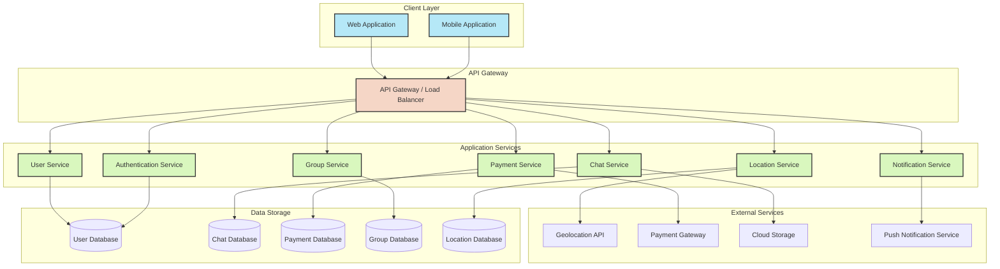
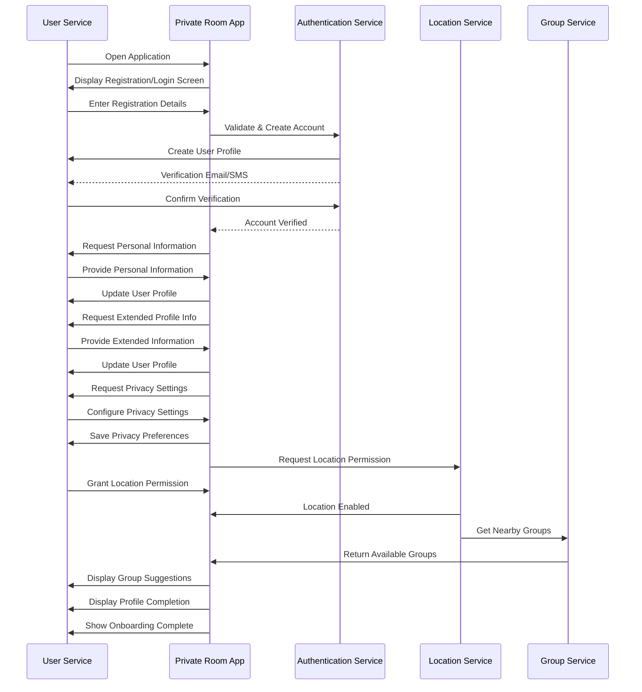
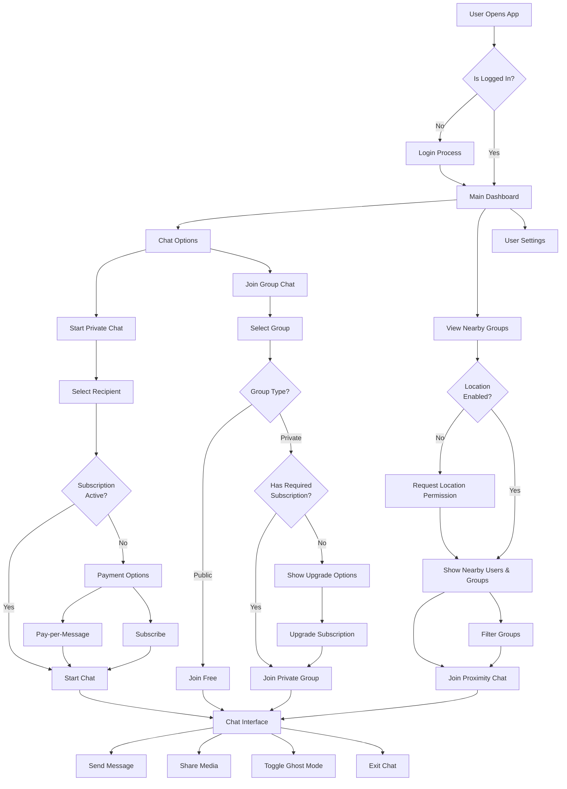
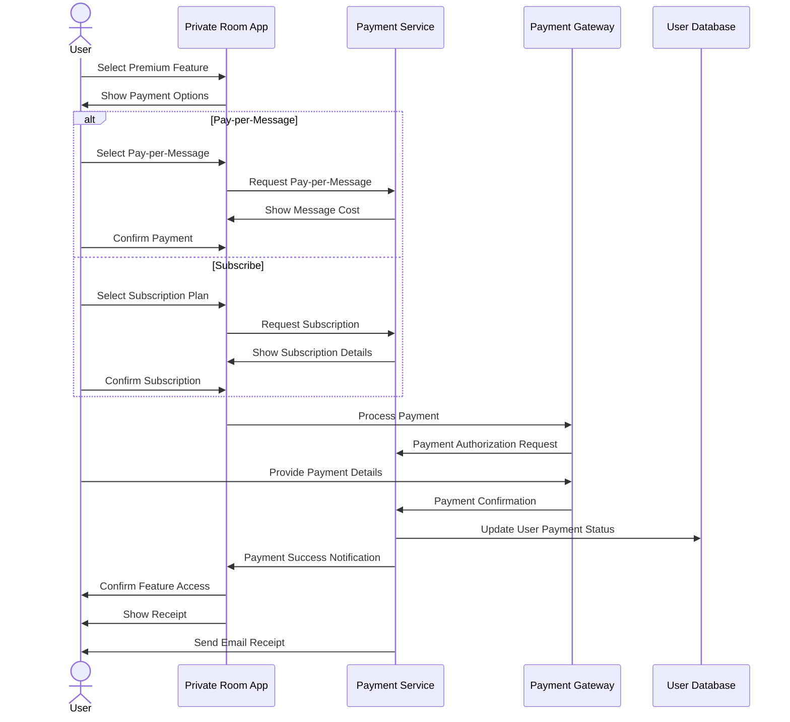
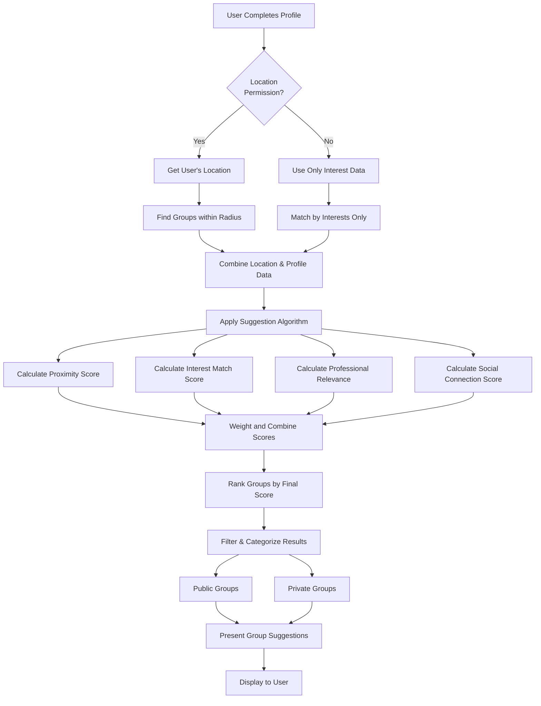

# Private Room - Flow Diagrams

## 1. System Architecture Overview

## 2. User Registration and Onboarding Flow

## 3. Chat and Group Functionality Flow

## 4. Payment Processing Flow

## 5. Group Suggestion Algorithm Flow

